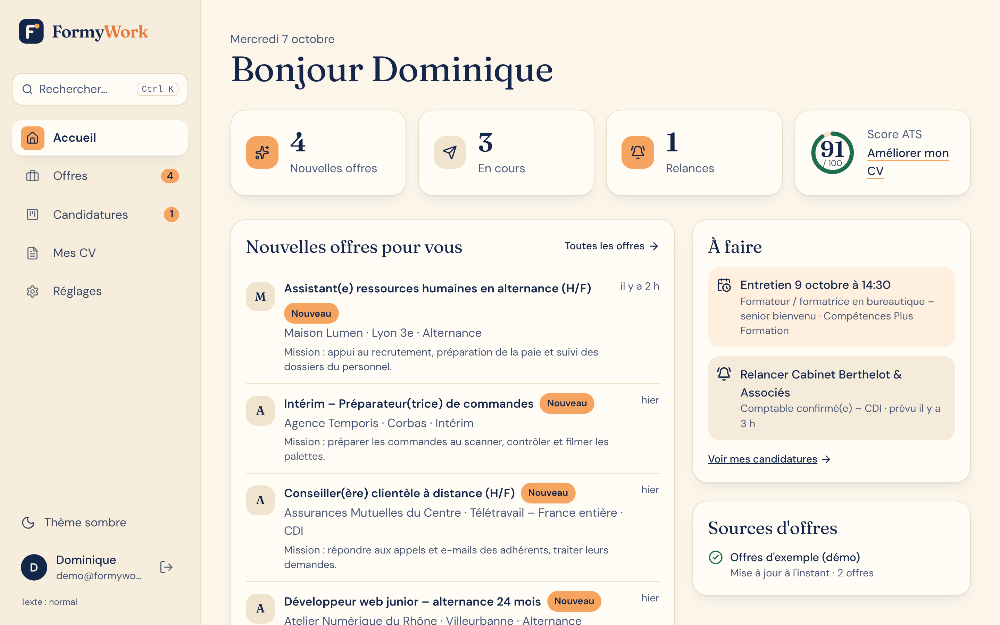

# FormyWork

Agrégateur d'offres d'emploi et d'alternance, avec un outil de CV compatible ATS
(les logiciels qui trient les CV) et un suivi des candidatures.
Application privée, pour 3 personnes, qui tourne sur **votre ordinateur**.



---

## 1. Installer (une seule fois)

Vous avez besoin de deux logiciels gratuits.

| Logiciel | Lien | Quelle version ? |
|---|---|---|
| **Python** | https://www.python.org/downloads/ | **3.13** (3.11 minimum) |
| **Node.js** | https://nodejs.org/fr | la version **LTS** (bouton de gauche) |

**Sous Windows** : pendant l'installation de Python, **cochez la case « Add python.exe to PATH »**
en bas de la première fenêtre. C'est l'erreur la plus fréquente.

**Sous Mac** : téléchargez les installateurs `.pkg` sur les deux sites et double-cliquez dessus.

**Sous Linux (Ubuntu/Debian)** : `sudo apt install python3 python3-venv nodejs npm`.

> Node.js sert seulement à reconstruire l'interface si vous la modifiez.
> Une interface déjà prête est fournie : FormyWork démarre même sans Node.js.

## 2. Lancer FormyWork

1. Téléchargez ce dossier `formywork` (ou tout le dépôt).
2. Lancez le démarrage :
   - **Windows** : double-cliquez sur **`start.bat`**.
   - **Mac / Linux** : ouvrez un Terminal dans le dossier `formywork` et tapez `./start.sh`.
3. La première fois, l'installation prend **2 à 5 minutes**. Ensuite, quelques secondes.
4. Le navigateur s'ouvre tout seul sur **http://127.0.0.1:8000**.
   Sinon, ouvrez cette adresse vous-même.
5. **Laissez la fenêtre noire ouverte** tant que vous utilisez FormyWork.
   Pour arrêter : fermez-la (ou `Ctrl + C`).

### Le mode démo

Au premier lancement, FormyWork est en **mode démo** : des offres d'exemple réalistes
(alternance, CDI, postes seniors…), un CV d'exemple et quelques candidatures.
Une nouvelle offre « arrive » toutes les 3 minutes pour montrer les notifications.

- Compte de démonstration : **demo@formywork.fr** / **demo1234**
  (bouton « Remplir pour moi » sur la page de connexion).
- Créez ensuite **votre** compte (3 comptes maximum, le compte démo ne compte pas).

Quand vos clés sont prêtes (voir plus bas), ouvrez le fichier `.env`,
mettez `DEMO_MODE=false` et relancez.

### En cas de problème

| Message | Que faire |
|---|---|
| « Python n'est pas installé » / « trop ancien » | Installez Python 3.13 (lien ci-dessus), puis relancez. Sous Windows, cochez « Add to PATH ». |
| « L'installation des composants Python a échoué » | Vérifiez internet. Si vous avez une version très récente de Python, installez Python 3.13, supprimez le dossier `.venv` et relancez. |
| « Le port 8000 est déjà utilisé » | FormyWork est sans doute déjà ouvert : allez sur http://127.0.0.1:8000. Sinon, changez `PORT=8000` dans `.env`. |
| Sous Mac : « impossible d'ouvrir start.sh » | Dans le Terminal : `chmod +x start.sh` puis `./start.sh`. |
| La page reste blanche | Rechargez la page (F5). Regardez les messages dans la fenêtre noire. |

Vos données (comptes, CV, candidatures) sont dans `formywork/data/formywork.db`.
Pour les sauvegarder, copiez ce fichier.

---

## 3. Ce que fait FormyWork

- **Offres** : une recherche (métier, lieu, distance, contrat dont alternance, date, télétravail)
  interroge toutes les sources en même temps et regroupe les doublons. Chaque source qui échoue
  est signalée sans bloquer les autres. Favoris, offres masquées, lien vers l'annonce d'origine.
- **Résumé de chaque offre** en 4 lignes (mission, profil, conditions, point d'attention) + 3 mots-clés.
  Avec l'IA si une clé Anthropic est configurée (mis en cache : jamais payé deux fois), sinon un
  résumé simple extrait de l'annonce.
- **Mises à jour automatiques** des recherches enregistrées (toutes les 12 min pour les APIs,
  toutes les 6 h pour les pages publiques), badge « Nouveau » et notification sans recharger la page.
  Les offres non revues depuis 21 jours sont retirées.
- **CV compatible ATS** : import PDF/Word/texte, éditeur par sections, score sur 100 expliqué point par
  point avec la correction à faire, export PDF (vrai texte) et Word, modèle sobre en une colonne.
- **CV adapté à une offre** : nouvelle version enregistrée, comparaison avant/après, score avant/après,
  « points à vérifier », lettre de motivation courte. **Rien n'est jamais inventé** : un contrôle
  automatique retire tout chiffre ou compétence absent de votre CV d'origine.
- **Postuler** : FormyWork choisit le bon CV (ou l'adapte), prépare la lettre et le message.
  - Si l'offre donne une adresse e-mail : envoi depuis **votre** boîte, après un écran qui montre
    **exactement** ce qui part (destinataire, objet, message, pièces jointes) et votre confirmation.
  - Sinon : ouverture de la page officielle de l'offre avec CV, lettre et réponses types prêts
    à copier ; vous postulez vous-même puis cliquez « J'ai bien postulé ».
  - Jamais d'envoi sans confirmation, historique de chaque envoi, protection contre les doublons.
  - Pourquoi pas de clic « robot » sur les sites ? Aucun site d'emploi ne l'autorise ; les
    automatisations avec des comptes mènent à des bannissements. FormyWork fait la version fiable.
- **Candidatures** : tableau en colonnes (À postuler, Postulé, Relance, Entretien, Refus, Offre),
  glisser-déposer ou menu « Étape », notes, dates, rappels de relance, CV utilisé.
- **Confort** : thème clair/sombre, taille du texte réglable (Réglages), navigation au clavier
  (`Ctrl + K` ou `/` pour la recherche rapide), utilisable sur téléphone.

---

## 4. Obtenir les clés (plus tard, toutes facultatives)

Toutes les clés se collent dans le fichier **`.env`** (dans le dossier `formywork`, créé au premier
lancement ; ouvrez-le avec le Bloc-notes ou TextEdit). Relancez FormyWork après chaque modification.
Ne partagez jamais ce fichier.

### Intelligence artificielle – Anthropic (résumés, CV adaptés, lettres)
1. Créez un compte sur https://console.anthropic.com et ajoutez un moyen de paiement (quelques euros suffisent).
2. Menu **API Keys** → **Create Key**, copiez la clé (`sk-ant-…`).
3. Dans `.env` : `ANTHROPIC_API_KEY=sk-ant-…`
4. Modèles utilisés (modifiables) : `AI_MODEL_SUMMARY=claude-haiku-4-5` (rapide et économique,
   pour les résumés) et `AI_MODEL_CV=claude-opus-5-5` (pour les CV et lettres).

### France Travail – API « Offres d'emploi v2 »
1. Créez un compte sur https://francetravail.io, puis **Mes applications → Créer une application**.
2. Abonnez l'application à l'API **« Offres d'emploi v2 »**.
3. Copiez l'identifiant client et la clé secrète dans `FRANCE_TRAVAIL_CLIENT_ID` et `FRANCE_TRAVAIL_CLIENT_SECRET`.
4. ⚠️ D'après data.gouv.fr, l'accès à cette API est actuellement soumis à une demande via le formulaire
   de contact de francetravail.io (révision des conditions de réutilisation). Il est possible que l'accès
   ne soit pas accordé tout de suite.

### Adzuna
1. Inscription sur https://developer.adzuna.com → **Register**.
2. Copiez `Application ID` et `Application Key` dans `ADZUNA_APP_ID` et `ADZUNA_APP_KEY`.
3. Quota gratuit par défaut : 250 requêtes par jour (FormyWork s'arrête à 200).

### Jooble
1. Demandez une clé sur https://jooble.org/api/about (formulaire, réponse par e-mail).
2. Collez-la dans `JOOBLE_API_KEY`. La clé gratuite a un quota limité : FormyWork l'utilise avec parcimonie (20 requêtes par jour).

### La Bonne Alternance (offres d'alternance)
1. Créez un compte sur https://api.apprentissage.beta.gouv.fr, puis **Mon compte → Profil → Générer un jeton**.
2. Collez le jeton dans `LBA_API_TOKEN`. Limite : 60 requêtes par minute.

### Envoi des candidatures par e-mail (Gmail)
1. Activez la **validation en deux étapes** sur votre compte Google.
2. Allez sur https://myaccount.google.com/apppasswords, créez un mot de passe d'application « FormyWork ».
3. Dans `.env` : `SMTP_ACCOUNTS=votre.adresse@gmail.com:abcdabcdabcdabcd`
   (l'adresse doit être celle de votre compte FormyWork ; plusieurs personnes : séparez par des virgules).
4. Autre fournisseur (Outlook, Orange…) : changez `SMTP_HOST` et `SMTP_PORT` selon ses indications.

Sans configuration, l'envoi est **simulé** en mode démo (rien ne part, c'est indiqué clairement).

### Lecture de pages publiques (désactivée par défaut)
`SCRAPING_ENABLED=true` active la lecture des pages de recherche publiques de Hellowork, avec ces règles :
pas de connexion ni de compte, respect du fichier `robots.txt`, 2 à 4 secondes entre deux pages,
2 pages maximum par recherche, cache local, arrêt immédiat et pause de 24 h au moindre blocage
(erreur 403/429 ou captcha), aucun contournement. **Indeed et LinkedIn ne sont pas lus** : leurs
conditions d'utilisation interdisent l'extraction automatique. À noter : le `robots.txt` de Hellowork
semble interdire ses pages de recherche ; dans ce cas FormyWork l'indique et ignore la source.

---

## 5. Ce qui a été vérifié, ce qui ne l'a pas été

| Élément | État |
|---|---|
| Mode démo complet (recherche, résumés, nouvelles offres, CV, ATS, postuler simulé, kanban) | Testé pour de vrai (navigateur + tests automatiques) |
| Analyse ATS, import/export PDF et Word, contrôle anti-invention | Tests automatiques |
| Normalisation et dédoublonnage des offres | Tests automatiques sur des réponses simulées |
| France Travail, Adzuna, Jooble, La Bonne Alternance | Codés d'après la documentation officielle et **testés uniquement avec des réponses simulées** : aucune clé n'était disponible. Certains détails de France Travail (codes de contrat d'alternance `E2`/`FS`, plafond de résultats) et de Jooble (rayon) n'ont pu être confirmés que partiellement. |
| Géocodage des villes (geo.api.gouv.fr) | Testé avec réponse simulée ; non joignable depuis l'environnement de développement |
| Hellowork (pages publiques) | Testé avec des pages simulées ; site réel non joint |
| Envoi d'e-mails SMTP / Gmail | Code prêt, **non testé avec une vraie boîte** (simulation testée) |
| IA Anthropic | Code prêt (sortie structurée validée), **non testé avec une vraie clé** ; replis sans IA testés |
| `start.sh` | Testé sous Linux sur une copie neuve du dossier |
| `start.bat` (Windows) | **Non testé** : aucun Windows disponible pendant le développement |

---

## 6. Pour les développeurs

```
formywork/
  backend/          API FastAPI (Python), SQLite + SQLAlchemy + Alembic
    app/sources/    une source = un fichier (France Travail, Adzuna, Jooble, LBA, Hellowork, démo)
    app/ats/        analyse ATS, import, export
    app/ai/         appels Anthropic + contrôle anti-invention
    app/apply/      parcours « Postuler »
    app/static/     interface compilée (générée par Vite, versionnée pour démarrer sans Node)
    tests/          tests pytest (aucun appel réseau réel)
  frontend/         React + TypeScript + Tailwind + Radix
  scripts/          logo (make_logo.py), captures d'écran (screenshots.mjs)
  docs/screenshots/ captures du mode démo
```

- Tests backend : `cd backend && ../.venv/bin/pip install -r requirements-dev.txt && ../.venv/bin/python -m pytest`
- Lint/format backend : `../.venv/bin/ruff check app tests && ../.venv/bin/ruff format app tests`
- Interface en développement : `cd frontend && npm run dev` (avec le backend lancé sur le port 8000)
- Vérifications interface : `npm run typecheck`, `npm run lint`, `npm run build`
- Documentation de l'API : http://127.0.0.1:8000/api/docs
- Nouvelle migration après modification des tables :
  `cd backend && ../.venv/bin/alembic revision --autogenerate -m "description"`

Choix techniques : FastAPI (API typée, asynchrone pour interroger les sources en parallèle),
SQLite (un seul fichier, idéal pour 3 personnes), APScheduler (tâches de fond sans serveur
supplémentaire), SSE pour le temps réel (simple, reconnexion automatique), Radix pour des
composants accessibles au clavier, ReportLab pour des PDF en vrai texte sans dépendance système.
